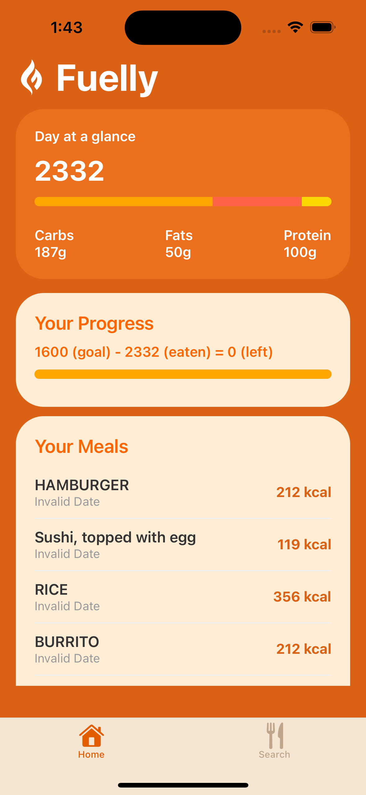
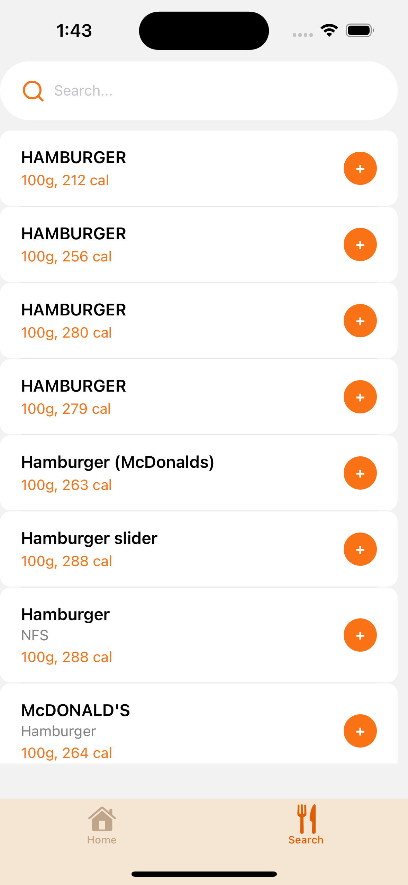

# Fuelly 🔥🍎

Fuelly is a full-stack mobile application that allows users to search foods using the USDA FoodData Central API, log consumed foods, and track daily calorie intake through a clean dashboard experience.

Built to demonstrate real-world production architecture using a custom backend and cloud deployment.

---

## ✨ Features

- Search foods using the USDA FoodData Central API
- Log foods to a persistent PostgreSQL database
- View calorie intake on a dashboard computed from logged foods
- Mobile-first UI built with React Native (Expo)
- Automatic refresh when navigating between screens
- Device-based user identification (no authentication required for MVP)

---

## 🎥 Screenshots

  
  &nbsp;&nbsp;&nbsp;
  

---

## 🎥 Demo

👉 **Watch 45-second demo:**  
https://youtube.com/shorts/AzNXy2UOa9s?feature=share

**Backend GraphQL Endpoint:**  
https://fuelly-bf8i.onrender.com/graphql  

---

## 🏗 Architecture Overview

React Native App (Expo)  
↓ GraphQL  
Apollo Server (Node.js)  
↓ SQL  
PostgreSQL (Supabase)  
↓  
USDA FoodData Central API  

- The frontend communicates **only** with the GraphQL server
- The backend handles:
  - External API requests
  - Database reads and writes
- Supabase is used **only as hosted PostgreSQL**, not as a backend framework

---

### Key Design Decisions

- Frontend communicates exclusively with a custom GraphQL API  
- Backend handles external API orchestration and database operations  
- Supabase is used strictly as hosted PostgreSQL (not as a backend framework)  
- Backend deployed to Render with production environment configuration  
- Health endpoint implemented to support uptime monitoring  

---

## 🧰 Tech Stack

### Frontend
- React Native
- Expo
- Apollo Client
- TypeScript

### Backend
- Node.js
- Express
- Apollo Server (GraphQL)
- PostgreSQL (Supabase hosted)
- pg (node-postgres)

### Infrastructure
- Render (Cloud Deployment)
- Supabase (Hosted PostgreSQL)
- USDA FoodData Central API

---

## 🔑 Environment Variables

Create a .env file inside the backend/ directory:

USDA_API_KEY=your_usda_api_key  
DATABASE_URL=your_supabase_postgres_connection_string  

.env files are intentionally ignored by Git to protect secrets.

---

## 🚀 Running the Project Locally

### Backend

cd backend  
npm install  
node server.js  

The GraphQL server runs on:  
http://localhost:4000/graphql

---

### Frontend

npm install  
npx expo start  

Run the app on:
- iOS Simulator
- Android Emulator
- Physical device using Expo Go

---

## 📌 Implementation Notes

- User identity is generated once per device and stored locally
- Logged foods are persisted in PostgreSQL
- Dashboard totals are computed client-side from logged foods
- Designed for easy extension (macros, dates, authentication, charts)

---

## 📈 Future Improvements

- Store macronutrients (protein, carbs, fats) in the database
- Daily log grouping and historical views
- User authentication (Supabase Auth or Firebase)
- Weekly/monthly trend charts

---

## 🧠 Why This Project Matters

Fuelly avoids backend-as-a-service shortcuts and instead demonstrates:
- Custom GraphQL API design
- Secure database connectivity
- Real data persistence
- Clean frontend/backend separation

This reflects how production-grade mobile applications are commonly built in industry.

---

## 👤 Author

Mantavya Sethi  
Computer Engineering Student  
University of Waterloo
